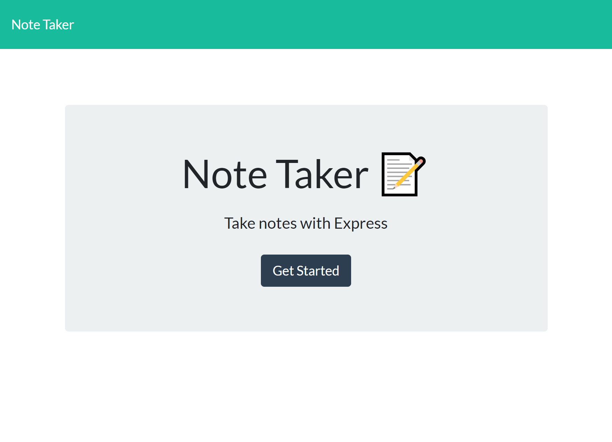
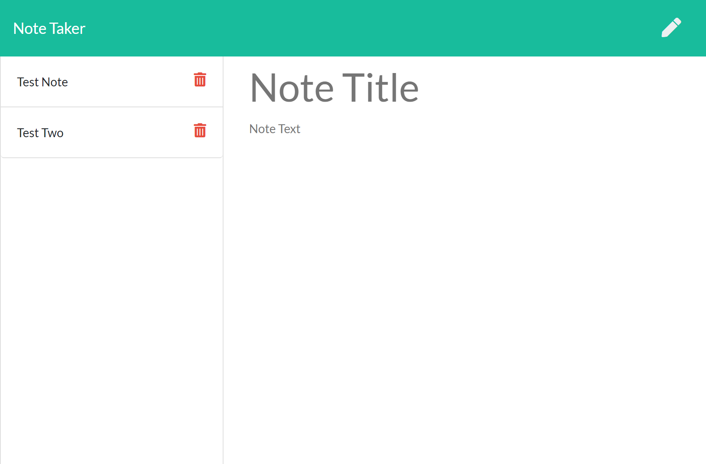

# note-taker

## Description

An application that uses an Express.js back end, used to write and save notes to a JSON file.

This project was undertaken as part of a coding bootcamp run through the University of Western Australia (UWA), and involved modifying starter code. The front end code was provided, while the back end was created from scratch. 

## Table of Contents

-   [Installation](#installation)
-   [Usage](#usage)
-   [Design Notes](#design-notes)
-   [Credits](#credits)
-   [Questions](#questions)
-   [Screenshots](#screenshots)
-   [Deployed Application](#heroku-link)

## Installation

If running locally, run 'npm i' from the command line to install required packages.

## Usage

If running locally, run 'npm start' from the command line to initialize application. 

## Design Notes

- Uses separate route modules
- Uses promisify to convert the fs module's "readFile" method to a promise based method
- Utilizes npm package nanoid [nanoid](https://www.npmjs.com/package/nanoid) to generate unique IDs for notes
- Utilizes npm package [prettier](https://www.npmjs.com/package/prettier) for formatting
- As per assignment instructions, there is no connected db. Rather, application reads from/writes to a JSON file. 

## Credits

Front end provided as part of the University of Western Australia's coding boot camp. The scope of this project was to build the back end for the application.

[Post by Justin Liu on Stack Overflow](https://stackoverflow.com/questions/5767325/how-can-i-remove-a-specific-item-from-an-array) was used as reference when determining how to remove a specific item from an array.

## Questions

For any questions pertaining to this project, please feel free to reach out via any of the contact methods listed below.
Please ensure that you include the name of this project ("note-taker") in any communications.

-   [GitHub](https://github.com/stephje)
-   [Email](mailto:s.jenkins3018@gmail.com)

## Screenshots

## Heroku Link

This application has been deployed via Heroku. 

Click [here](https://rugged-kings-canyon-90464.herokuapp.com/) to access the deployed application.

